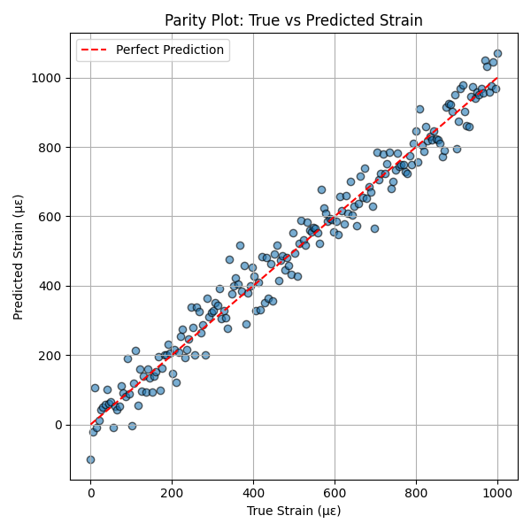
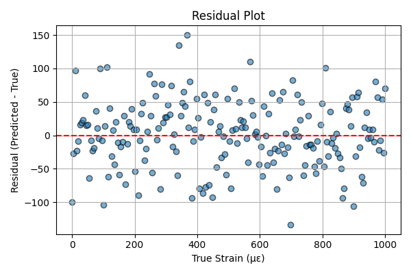

# Concrete Strain Prediction using Physics-Informed Neural Networks (PINNs)

This project presents a lightweight neural network for predicting strain in concrete under loading, trained on real segment-level measurements. It uses a physics-informed loss to enforce strain-load consistency in the elastic regime.

## 🔧 Model Inputs
- Load (kN)
- Displacement (mm)
- Load rate (kN/step)

## 🎯 Output
- Concrete surface strain (µε)

## 📈 Final Model Performance
- **Test RMSE**: 66.89 µε

## 📊 Model Evaluation Plots

### 🟦 Parity Plot
Shows predicted strain vs. true strain.



---

### 🟥 Residuals Plot
Shows prediction error (Predicted - True) across the test set.



## 📁 Project Structure
```
data/         # Raw & split data (CSV)
models/       # Trained PyTorch model + scalers
notebooks/    # Jupyter notebooks (training, analysis)
plots/        # Figures for paper and README
paper/        # arXiv draft (LaTeX)
```

## ▶️ To Run
```bash
pip install -r requirements.txt
jupyter notebook
```

---

**Author:** [Your Name]  
**License:** MIT  
